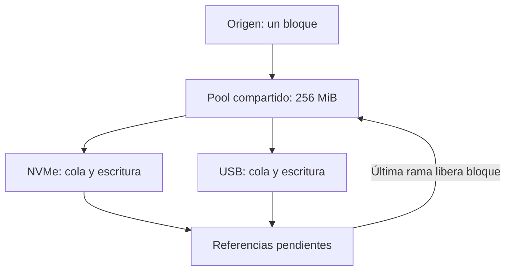

# FAN-OUT: diagnóstico y plan de rendimiento

## Contrato buscado

Una sola lectura física del origen entrega cada bloque a todos los destinos. El objetivo de cada destino rápido es acercarse a `min(tasa real del origen, tasa real del destino, tasa real de la ruta compartida)`; 150 MB/s no es un techo. Un NVMe puede superar 1000 MB/s si también pueden sostenerlo el origen y la ruta. Esta independencia requiere almacenamiento adicional para la diferencia de velocidades: memoria finita, un spool físicamente independiente o lecturas posteriores del origen. No se puede sostener indefinidamente una tasa de lectura superior a la del destino más lento con solo un buffer finito y sin spool.

## Estado comprobado en el código actual

- `CopyEngine.ReadAndFanOutSequentialAsync` lee una vez por bloque y lo entrega a las colas de los destinos activos.
- El pool compartido está fijado en 256 MiB y los bloques tienen un máximo nominal de 8 MiB. `SharedFanoutBufferPool.Lease.ReleaseReference` libera páginas solo después de que **todos** los destinos entregados liberen su referencia.
- `DeliverDataAsync` usa canales no acotados y `ReserveBacklog`/`ReservePendingPayload` solo contabilizan bytes; `BacklogTargetBytes` no es una barrera ni activa aislamiento de ramas.
- El pool sí aplica backpressure en `RentAsync`. Con un USB sostenidamente más lento, las referencias USB terminan reteniendo el pool; entonces la siguiente lectura se detiene y el rendimiento de los demás destinos converge con el USB. El test `FastDestinationCannotFreeTheSourceWindowWhileSlowDestinationStillOwnsBlocks` reproduce exactamente esta dependencia de memoria.
- `EndMessage` se procesa después de todos los datos de cada archivo; `FinishFile` espera las escrituras pendientes antes del commit. La finalización segura de un archivo lento puede retrasar las fases siguientes de ese destino.
- `DeviceScheduler` permite **una** operación I/O por dispositivo físico y no explora queue depth. La escritura Direct usa `WriteFile` síncrono. La ruta buffered ahora abre el archivo con `FileOptions.Asynchronous` y usa `RandomAccess.WriteAsync` por offset para evitar ocupar un hilo mientras espera un disco lento; esto no elimina el acoplamiento de memoria.
- El tamaño del bloque se selecciona por archivo con `SelectSharedFanoutBlockSize`, sin adaptación por throughput o latencia. La memoria del pool y el tamaño de bloque son constantes.
- La UI muestra el progreso y la velocidad lógica de finalización a partir del **mínimo** de bytes escritos por los destinos activos (`active.Min(item => item.Written)`). Esa cifra sigue al más lento por diseño y puede ocultar que uno rápido va adelantado; no demuestra por sí sola que su escritura física se haya frenado.

La versión anterior de este documento afirmaba que había replay por rama, `PipelineGovernor`, `AdaptiveTransferSizer`, queue depth adaptativo y alineaciones superiores a 64 KiB. Esas rutas no existen en el producto actual; las pruebas de arquitectura incluso prohíben algunas de ellas. No se deben usar esas afirmaciones para evaluar el rendimiento.

## Límite matemático y prueba física

Ejemplo ilustrativo: origen y destinos rápidos a 150 MB/s, USB a 20 MB/s. El retraso crece a ~130 MB/s. Con 256 MiB compartidos, la ventana puede agotarse en unos 2 s si el resto de condiciones permiten ese ritmo. Después, un destino rápido ya no recibe bloques nuevos a 150 MB/s de forma sostenida. La duración exacta depende de tamaños de archivo, cachés, hubs y latencia; esta estimación no es un benchmark.

Comparar A) origen → NVMe solamente, B) origen → NVMe + USB lento, y C) origen → SATA + NVMe + USB. Usar un archivo mayor que RAM/caché efectiva y medir, durante COPY separadamente de VERIFY, bytes/s físicos por dispositivo, `SourceRead5sBytesPerSecond`, `BufferWaitTime`, `PeakBufferedBytes`, `DeviceSchedulers[*].QueuedBytes`, `Written` por destino y tiempo de commit. Repetir con distintos puertos/hubs. Si B llena el pool y la tasa del origen cae hacia la del USB, la hipótesis queda confirmada en ese equipo.

## Cambio estructural pendiente para aislar una rama lenta

Diseñar un spool secuencial por destino lento que preserve **una sola lectura del origen** y libere su referencia del bloque compartido solo cuando una copia íntegra, comprobada y recuperable del bloque haya sido persistida en el spool. Situarlo en un dispositivo físico probado distinto del origen, de los destinos rápidos y del lento. Si no se conoce identidad física, espacio disponible o durabilidad, mantener la ruta actual con backpressure: perder rendimiento es preferible a perder datos. Un spool en el mismo HDD, hub o volumen origen puede empeorar todos los destinos.

La cola de replay necesita orden por archivo y offset, barrera de `EndMessage`, checksum y manejo de escritura parcial, cancelación, desconexión, falta de espacio, limpieza y reinicio. Su capacidad también es finita: una copia grande a 150 MB/s con USB de 20 MB/s acumula 130 MB/s de spool. Cuando se agote, debe volver al backpressure sin corromper los bloques ni fingir velocidad sostenida.

No activar replay ni aumentar memoria/QD por intuición. Primero medir la combinación real de discos y después validar el diseño con pruebas de falla y benchmarks A/B en Windows físico. La ruta buffered asíncrona actual es una corrección de ocupación de hilos; el desacoplamiento sostenido sigue abierto.

## Simulador de la ruta lógica

`tools/simulate_fanout.py` reproduce lectura secuencial por bloques, colas de escritura independientes, una operación I/O por destino y liberación de cada bloque al completarse todas sus ramas. Acepta tasas efectivas, latencia por operación, pausa del USB, tamaño de pool y bloque. Un spool opcional representa un **límite superior optimista**: es físicamente independiente, escribe a la tasa indicada, tiene capacidad limitada y sus lecturas no consumen ancho de banda en el modelo. No representa código de producción ni garantiza rendimiento.



Ejemplo reproducible (MiB/s efectivos, 4 GiB, bloques de 8 MiB, origen 1600, NVMe 1000, USB 40):

| Ruta simulada | NVMe termina | USB termina | Pool/spool máximo |
| --- | ---: | ---: | ---: |
| NVMe solo | 4,10 s | — | 256/0 MiB |
| NVMe + USB, ruta actual | 96,02 s | 102,41 s | 256/0 MiB |
| USB pausado entre 2 y 10 s | 104,02 s | 110,41 s | 256/0 MiB |
| Spool ideal de 512 MiB | 83,23 s | 102,41 s | 256/512 MiB |
| Spool ideal de 4096 MiB | 4,10 s | 102,41 s | 256/3944 MiB |

El spool grande adelanta el **fin del NVMe**, pero el trabajo completo sigue esperando al USB. El spool pequeño se llena y vuelve a imponer backpressure. En la ruta actual, el indicador global de la UI representa el mínimo de los destinos y muestra el avance del USB, aunque inicialmente el NVMe vaya adelantado.

El resultado no depende de fijar el NVMe en 1000 MiB/s: con origen 3500 y NVMe 2400 MiB/s, el mismo archivo simulado termina en 1,71 s si el NVMe está solo y en 96,01 s al añadir el USB de 40 MiB/s. Cambiar la tasa nominal del disco rápido no suprime la espera del pool.

```bash
python3 tools/simulate_fanout.py --size 4096 --source 1600 --fast 1000 --slow 40
python3 tools/simulate_fanout.py --size 4096 --source 1600 --fast 1000 --slow 40 --stall-start 2 --stall-end 10
python3 tools/simulate_fanout.py --size 4096 --source 1600 --fast 1000 --slow 40 --spool-capacity 4096 --spool-rate 1200
python3 -m unittest discover -s tools -p 'test_simulate_fanout.py'
```

La simulación no predice caché de Windows, IOPS variables, filesystem, controlador/hub USB compartido, thermal throttling, flush/commit ni VERIFY. La tasa de origen puede limitar todos los destinos rápidos aun sin USB. La profundidad física fija de una I/O por dispositivo también introduce un coste por latencia: con bloque de tamaño `B`, tasa `R` y latencia por operación `L`, el techo aproximado por destino es `B / (B/R + L)`; elevar QD podría mejorar ciertos NVMe, pero requiere evidencia física y garantías de orden/commit. Para diagnosticar un hub o dispositivo compartido, introducir en el simulador las tasas **efectivas medidas bajo esa contención**, no las cifras comerciales nominales.
